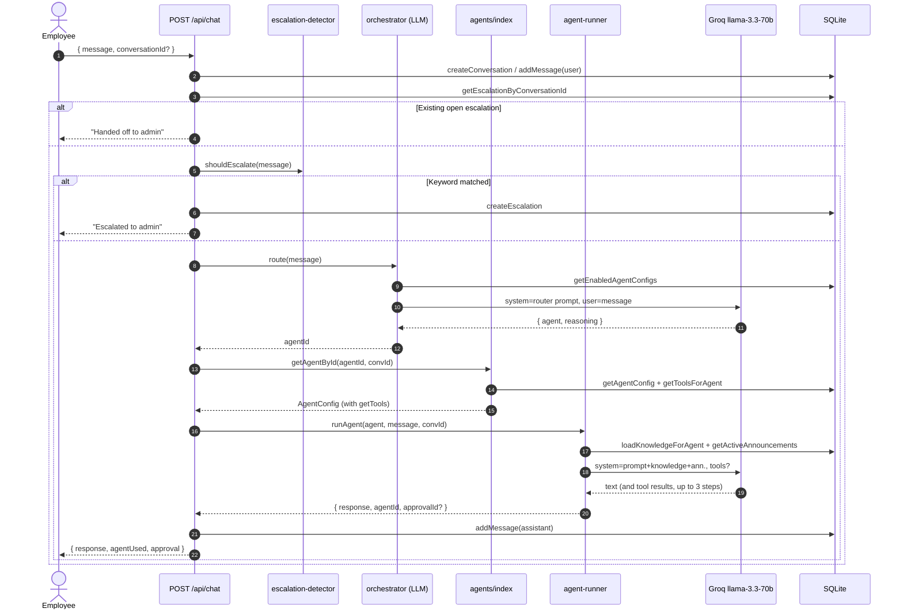
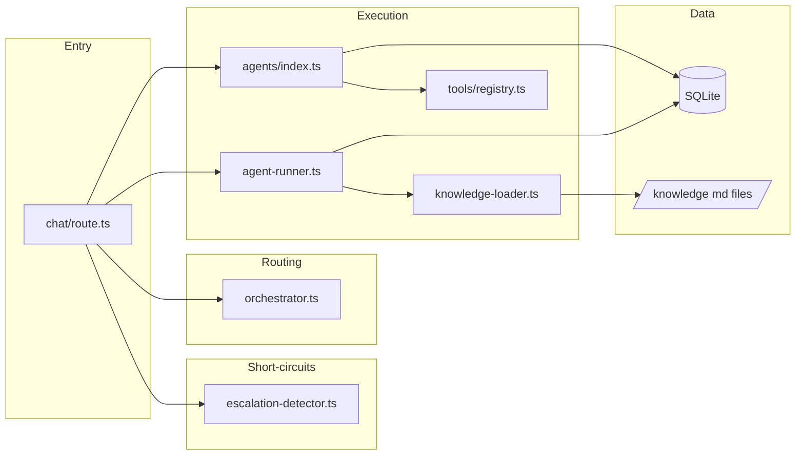

# Agent Orchestration — Architecture

This page is the technical companion to the [Overview](overview.md). It shows
how a single chat request flows through the system, which modules own which
step, and where the orchestration LLM's contract is defined.

## Request flow

The chat API in `src/app/api/chat/route.ts` is the single entry point for both
the web UI and Slack. It composes four small modules in sequence: escalation
detection, routing, agent loading, and agent execution.



The "up to 3 steps" cap on the agent's tool loop is set in `runAgent` via
`stopWhen: stepCountIs(3)`. It is the only guardrail preventing a runaway
tool-calling loop, so changes to that number should be deliberate.

## Module responsibilities



| Module | Responsibility | Does NOT |
|---|---|---|
| `chat/route.ts` | Orchestrate the four-step pipeline, persist messages, shape the response | Make any LLM call directly |
| `escalation-detector.ts` | Pure keyword match against the user message | Talk to the LLM, hit the DB |
| `orchestrator.ts` | Build the router prompt from enabled agents, call the LLM, parse JSON, fall back on failure | Run the agent, load knowledge, call tools |
| `agents/index.ts` | Resolve an agent ID to a runnable `AgentConfig`, lazily bind tools when called | Run inference |
| `agent-runner.ts` | Compose final system prompt, run the LLM with the agent's tools, capture tool outputs | Decide which agent to run |
| `knowledge-loader.ts` | Read markdown from `src/knowledge/` for a given agent | Cache invalidation across requests (recomputed each call) |
| `tools/registry.ts` | Define the set of built-in tools available to bind to agents | Persist anything |

## The orchestrator's contract

The orchestrator LLM is given exactly one job: pick an agent. The prompt is
built fresh on every request from the current set of enabled agents
(`src/core/orchestrator.ts`):

```text
You are an HR request router. Classify the employee's message and route it
to the correct agent.

Available agents:
- policy_agent: <description>
- benefits_agent: <description>
- leave_agent: <description>
...

Rules:
- Read each agent's description carefully.
- Route to the agent whose description best matches the employee's intent.
- For policy questions, prefer specialized agents (leave, recruiting,
  onboarding) over the general policy agent.
- For submission/application requests, route to agents with action capabilities
  (e.g., benefits).
- When in doubt, use <fallback agent>.

Respond with ONLY valid JSON in this exact format:
{"agent": "<fallback>", "reasoning": "brief reason"}
```

Two properties matter here:

- **The set of agents is read at routing time, not at startup.** Adding or
  disabling an agent in the admin dashboard takes effect on the very next
  message — no redeploy, no warm cache to bust.
- **The fallback is a real agent, not a sentinel.** If the LLM returns
  malformed JSON or errors, `route()` returns the fallback's ID. The pipeline
  always produces an agent; it never returns "no answer."

## Failure modes and where they land

| Failure | Where caught | What the employee sees |
|---|---|---|
| Orchestrator LLM throws | `try/catch` in `route()` | Fallback agent answers normally |
| Orchestrator returns non-JSON | `JSON.parse` throws inside the `try` | Same as above |
| Orchestrator returns unknown agent ID | `getAgentById` returns `undefined` → `chat/route.ts` retries with `policy_agent` | Policy agent answers |
| No agents enabled at all | `route()` returns `{ agent: "policy_agent", ... }`; if that is also missing, API returns 500 | Generic error |
| Agent's tool throws | Vercel AI SDK surfaces the tool error; the loop continues for remaining steps | Agent's text response, possibly without the tool side effect |

The deliberate design here is that routing is a **best-effort decision over a
guaranteed-safe fallback**. A wrong route still produces a coherent answer
from the handbook/policy agent. A failed route produces the same.

## What to read next

- **Decisions (planned):** why the orchestrator is a separate LLM call instead
  of a function-calling tool router, and why we cap agent tool loops at 3
  steps.
- **Playbook (planned):** triage steps when employees report being routed to
  the wrong agent.
