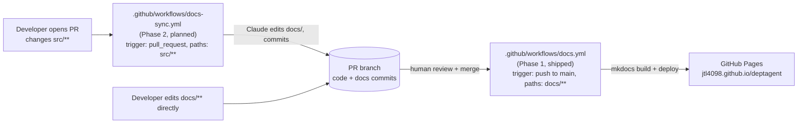
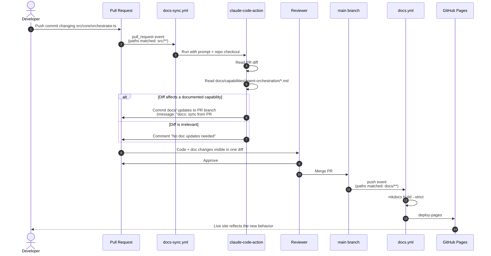
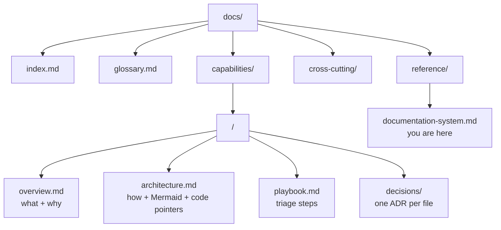

# Documentation System

This site is the source of truth for DeptAgent's documentation. The pages you
read here live in the same Git repository as the code, get reviewed alongside
code in pull requests, and are published automatically. This page explains how
that pipeline is built and how it keeps itself in sync when the code changes.

## Why this approach

Documentation outside the code repository — in a wiki, in Confluence, in
Notion — does not get reviewed when the code changes. The diff is invisible to
the people merging the change. Over time, docs drift, then rot, then become
worse than no docs at all because they actively mislead.

The remedy is to put docs in the repo. Now:

- Doc changes show up in the same PR as the code that prompted them.
- Code review is the natural moment to update or invalidate a doc.
- The published site is just a rendering of what is on the branch.

The system below operationalizes that idea with two small GitHub Actions
workflows.

## Two-workflow architecture



The two workflows are independent. Each looks only at its own paths filter and
does its own job:

| Workflow | Triggered by | What it does | Status |
|---|---|---|---|
| `docs.yml` | Push to `main` that touches `docs/**`, `mkdocs.yml`, the requirements file, or this workflow | Builds the MkDocs Material site with `mkdocs build --strict` and deploys to GitHub Pages | Shipped |
| `docs-sync.yml` | PR opened or synchronized whose diff touches `src/**` | Runs Claude against the PR. Claude reads the code diff, updates the relevant capability docs in `docs/`, and commits the doc changes to the PR branch | Planned (next phase) |

The trick is that `docs.yml` and `docs-sync.yml` cannot trigger each other in a
loop: `docs.yml` ignores `src/**`, and `docs-sync.yml` ignores `docs/**`. A
doc-only PR rebuilds the site after merge but never invokes Claude. A code PR
invokes Claude but does not rebuild the site until the resulting docs land on
`main`.

## Phase 1 — docs-as-code (shipped)

Source: [`.github/workflows/docs.yml`](https://github.com/jtl4098/deptagent/blob/main/.github/workflows/docs.yml)

The pipeline is deliberately small:

1. Checkout.
2. `pip install -r requirements-docs.txt`.
3. `mkdocs build --strict` — fails the run if any link or include is broken.
4. Upload the built site as a Pages artifact.
5. Deploy with `actions/deploy-pages@v4`.

The paths filter is:

```yaml
paths:
  - 'docs/**'
  - 'mkdocs.yml'
  - 'requirements-docs.txt'
  - '.github/workflows/docs.yml'
```

Anything else — including all of `src/**`, the package manifest, the
`.gitignore` — is ignored. This was verified during the PoC by pushing
non-docs commits and confirming no workflow run was created.

The strict build is intentional. A broken cross-reference or a missing
admonition syntax should fail the deploy, not silently ship a 404 into the
sidebar.

## Phase 2 — AI-assisted doc sync (planned)

Source: `.github/workflows/docs-sync.yml` (not yet committed)

This workflow uses [`anthropics/claude-code-action@v1`](https://github.com/anthropics/claude-code-action),
following Anthropic's official "Documentation Sync" pattern. On every PR that
modifies `src/**`, the workflow:

1. Checks out the PR head branch.
2. Hands Claude a prompt that includes the PR number, the repo's documentation
   taxonomy, the list of existing capabilities, and a set of rules about what
   Claude may and may not change.
3. Claude reads the diff, edits the relevant files under `docs/` only, and
   commits them back to the PR branch with a message like `docs: sync from
   PR #<n>`.
4. If Claude judges that the diff does not meaningfully affect any documented
   capability, it posts a single PR comment saying so and exits without
   committing.

The prompt enforces three hard rules that are easy to violate accidentally:

- **Only edit `docs/`.** Claude has `Read,Write,Edit,Bash(git:*)` allowed
  tools, scoped to documentation. Code is never modified by this workflow.
- **Use domain language.** Symbol names and file paths belong in a code-pointer
  table at the bottom of an architecture page, not in the prose.
- **Do not invent a fifth doc type.** Each capability has at most four files:
  `overview.md`, `architecture.md`, `playbook.md`, and a `decisions/` folder.
  When the diff is meta-level (build config, CI, dependency map), the new
  page belongs under `docs/reference/` instead.

The human still merges the PR. Claude's commits are visible in the same diff
as the code change and are reviewed at the same time.

## End-to-end: from architectural change to live docs

The example below is what happens when a developer changes how the
orchestrator picks a fallback agent — an architectural change that should be
reflected in the Agent Orchestration capability docs.



What this gets you in practice:

- **Stale docs become rare.** Forgetting to update a doc requires both the
  author and the reviewer to overlook an AI-generated diff that is already in
  the PR. The default path of least resistance is the correct one.
- **Drift is discoverable.** If `docs-sync.yml` posts "No doc updates needed"
  but the reviewer disagrees, that is the moment to either fix the doc by
  hand or refine the prompt. The signal is visible.
- **The publish step is dumb.** `docs.yml` does not know about Claude, the
  diff, or the reviewer. It only knows how to turn markdown into HTML and put
  it behind a URL. This makes it boring, which is what you want from a deploy
  workflow.

## Doc taxonomy



The hard rule: **never add a fifth document type inside a capability folder.**
The set of four — overview, architecture, decisions, playbook — was chosen
because adding categories explodes maintenance cost without improving the
reader's experience. Anything that does not fit one of these four belongs in
`reference/` or `cross-cutting/`, not in a new per-capability slot.

The audience for everything under `capabilities/` is a developer or technical
PM with some domain familiarity. They know what an LLM tool call is. They do
not need every Android Fragment, React hook, or SQLite table named in the
prose. Code pointers go in tables; prose stays in domain language.

## Failure modes and what to do

| Symptom | Cause | What to do |
|---|---|---|
| Phase 1 build fails on `mkdocs build --strict` | Broken cross-reference, missing image, invalid admonition syntax | The Action log lists the file and line. Fix on a branch, open a PR. Strict failures should be fixed, not bypassed. |
| Phase 1 deploy succeeds but a page 404s on Pages | Path mismatch in `nav:` vs file location | Check `mkdocs.yml` `nav:`. The path is relative to `docs/`. |
| Phase 2 commits a doc change that is wrong | LLM misread the diff or hallucinated a code path | Push a correction on the same PR branch as a normal commit. Refine the prompt rules in `docs-sync.yml` if the failure is systematic. |
| Phase 2 says "No doc updates needed" but reviewer disagrees | Prompt rules too conservative, or the affected capability is not yet documented | Either write the doc by hand on the same PR, or first add an `overview.md` for that capability so Claude has something to maintain. |
| `docs.yml` runs on a code-only push | paths filter has been weakened | Restore the original filter (`docs/**`, `mkdocs.yml`, `requirements-docs.txt`, `.github/workflows/docs.yml`). Verify by editing a non-docs file in a PR and confirming the workflow does not appear in the Actions tab. |

## Replicating this in another repo

To stand the same system up in a different codebase (the WSL Android repo, for
example):

1. Copy `mkdocs.yml`, `requirements-docs.txt`, `.github/workflows/docs.yml`,
   and seed `docs/index.md`.
2. In `mkdocs.yml`, set `site_name` and `repo_url`; rewrite `nav:` to point
   to whatever capabilities the target repo has.
3. In `docs.yml`, set `branches:` to the target repo's release line
   (`develop` for WSL, `main` here).
4. In repo Settings → Pages, set Source to "GitHub Actions".
5. Seed at least one capability's `overview.md` so the AI sync workflow has
   something to maintain on day one.
6. Add `.github/workflows/docs-sync.yml` and the `ANTHROPIC_API_KEY` secret
   when ready to enable Phase 2.

The Phase 1 setup is roughly 50 lines of YAML and one strict build. The Phase
2 setup is a second workflow plus a secret. Both are repo-local — no shared
infrastructure to provision.
