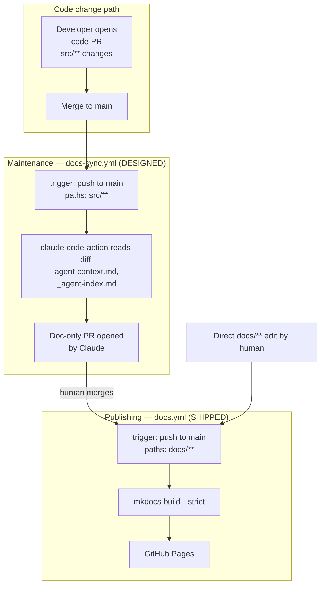
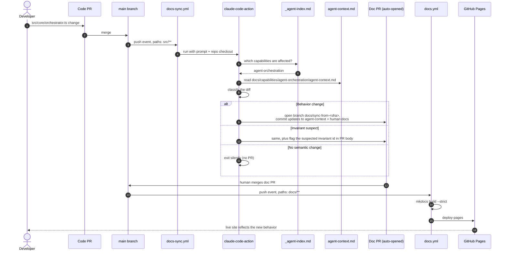
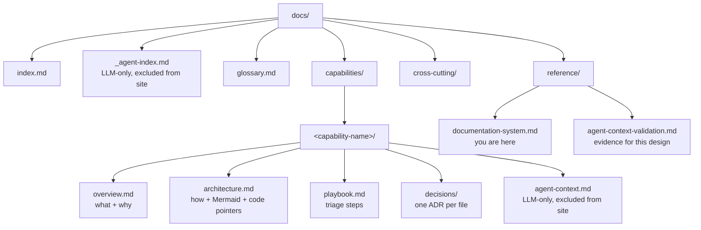

# Documentation System

This site is the source of truth for DeptAgent's documentation. The pages
you read here live in the same Git repository as the code, get reviewed
alongside code in pull requests, and are published automatically. This
page is the canonical record of how that system is designed, what was
considered and rejected, and how it keeps itself in sync when the code
changes.

> Status: Phase 1 shipped. Agent-context layer shipped. Phase 2 designed,
> not yet built. See **Validation** below for the empirical results that
> back the design decisions.

## Why this approach

Documentation outside the code repository — in a wiki, in Confluence, in
Notion, in a third-party AI doc tool — does not get reviewed when the
code changes. The diff is invisible to the people merging the change.
Over time, docs drift, then rot, then become worse than no docs at all
because they actively mislead.

The remedy is to put docs in the repo. Now:

- Doc changes show up in the same PR as (or are causally tied to) the
  code that prompted them.
- Code review is the natural moment to update or invalidate a doc.
- The published site is just a rendering of what is on the branch.

### Alternatives considered (and rejected)

| Option | Why rejected |
|---|---|
| Eraser AI (or other off-repo AI doc tools) | Source of truth lives outside the code repo; doc changes are invisible during code review. Paid plan + per-call pricing. Same drift failure mode we are designing against. |
| GitHub Wiki | Separate Git repo; no co-review with code, no branch protection. Drift risk identical to external tools. |
| Confluence / Notion / external knowledge bases | Additional credentials and tooling. Same root failure — docs live where code review can't see them. |
| Docusaurus | Heavier (React build), feature-rich beyond what's needed. Reconsider only if MkDocs proves too limited. |
| PlantUML or D2 for diagrams | PlantUML needs a JVM in CI; D2 has no native GitHub render. Mermaid wins on ubiquity and zero extra infrastructure. |

All external-tool alternatives share the same root failure: the doc
lives somewhere the code review process can't see, so nothing
structurally forces docs and code to stay in sync. In-repo docs-as-code
makes the PR the enforcement point.

## Architecture at a glance

The system has three concerns: **publishing** (humans see a site),
**maintenance** (docs stay in sync when code changes), and **agent
access** (LLMs read docs efficiently to do their work, including the
maintenance itself).



The two workflows are disjoint by paths-filter:

| Workflow | Triggers on | Ignores | Status |
|---|---|---|---|
| `docs.yml` | `docs/**`, `mkdocs.yml`, `requirements-docs.txt`, `.github/workflows/docs.yml` | `src/**`, everything else | **Shipped** |
| `docs-sync.yml` | `src/**` (post-merge to `main`) | `docs/**` | **Designed (next phase)** |

They cannot trigger each other in a loop. A doc-only PR (including
the ones Phase 2 opens) reaches Phase 1 only. A code-only PR reaches
Phase 2 only. The publish step is intentionally blind to who or what
generated the docs — it only renders markdown.

## Phase 1 — Publishing (shipped)

Source: [`.github/workflows/docs.yml`](https://github.com/jtl4098/deptagent/blob/main/.github/workflows/docs.yml)

The pipeline is deliberately small:

1. Checkout.
2. `pip install -r requirements-docs.txt`.
3. `mkdocs build --strict` — fails the run if any link or include is
   broken.
4. Upload the built site as a Pages artifact.
5. Deploy with `actions/deploy-pages@v4`.

The paths filter:

```yaml
paths:
  - 'docs/**'
  - 'mkdocs.yml'
  - 'requirements-docs.txt'
  - '.github/workflows/docs.yml'
```

Anything else — including all of `src/**`, the package manifest, the
`.gitignore` — is ignored. Verified during the PoC by pushing three
non-docs commits to `main` and confirming no workflow run was created.

The strict build is intentional. A broken cross-reference or invalid
admonition syntax should fail the deploy, not silently ship a 404 into
the sidebar.

## Phase 2 — AI-assisted maintenance (designed)

Source: `.github/workflows/docs-sync.yml` (not yet committed)

This workflow uses
[`anthropics/claude-code-action@v1`](https://github.com/anthropics/claude-code-action).
Anthropic's official "Documentation Sync" pattern fires on `pull_request`
events and auto-commits to the same PR branch. We deliberately diverge
from that pattern: this workflow fires **post-merge** and opens a
**doc-only PR**.

### Trigger model

```yaml
on:
  push:
    branches: [main]
    paths:
      - 'src/**'

concurrency:
  group: doc-sync
  cancel-in-progress: false
```

### Why post-merge instead of PR-time

Three reasons we chose this divergence:

- **One AI invocation per code change, not one per push.** PR-time
  triggers re-run on every force-push, fixup commit, and rebase. At
  team scale that compounds quickly into noise and API spend.
- **Separated review surfaces.** Code reviewers focus on the code PR.
  Doc reviewers focus on the doc PR (often the same person, sometimes
  not). Mixing AI-generated doc commits into the code PR history makes
  the code review noisier.
- **AI mistakes don't block code merge.** A bad Phase 2 output produces
  a doc PR that humans can fix or close. The code merge is already
  done.

The cost is that the code PR no longer shows doc implications during
its own review — a real loss. We trade that for the reliability and
review-quality wins above.

### What Phase 2 does on each invocation

1. Reads the merge commit's diff against the previous `main` head.
2. Reads `docs/_agent-index.md` to identify which capabilities are
   affected by the changed file paths.
3. For each affected capability, reads its `agent-context.md` (and
   optionally `overview.md` / `architecture.md`).
4. Classifies the diff:
   - **No semantic change** (refactor, rename, formatting) → exit
     without opening a PR.
   - **Behavior change** → update affected docs to match, including
     advancing the `last_synced_from` SHA in each touched
     `agent-context.md`.
   - **Invariant suspect** → make the updates AND surface the suspected
     violation prominently in the doc PR body.
5. Commits all changes on a branch named
   `docs/sync-from-<merge-sha>` and opens a PR targeting `main`.

The prompt enforces hard rules: edit `docs/` only, never `src/`; use
domain language in prose; never invent a fifth doc type; cite the
specific invariant ID when flagging a suspected break.

## Agent-context layer

Alongside the human-readable docs (`overview.md`, `architecture.md`,
`playbook.md`, `decisions/`), every capability owns an
**`agent-context.md`** file in the same folder. This is the file the
docs-sync workflow (and any other agent) reads first when investigating
that capability.

### What's in it

A YAML frontmatter capturing structured facts that are not trivially
recoverable from a single read of the source code, plus a short prose
section. Schema:

```yaml
---
capability: <slug>
version: 1
last_synced_from: <commit SHA the file describes>

entry_points:        # the 2-5 source locations that matter most
contracts:           # public surface — input/output + side effects
invariants:          # claims that must remain true; each has a stable id
                     # so Phase 2 can flag suspected violations by name
upstream_deps:       # what this capability reads from
downstream_consumers: # who reads this capability's outputs
common_changes:      # "when you do X, you typically touch Y, Z"
gotchas:             # silent fallbacks, missing idempotency, in-memory
                     # state that resets on deploy, hidden coupling
cross_refs:          # related capabilities + how they connect
---

# <Capability> — Agent Context

## Mental model
<one or two sentences in domain language>

## Read order (if you have a small token budget)
1. ...
```

### Why it exists

Two reasons:

1. **Search-overhead elimination.** At agent invocation time, the
   single biggest cost of "understand this capability" isn't reading
   code — it's *finding* the right code. Grep returns dozens of
   candidates; the agent reads several wrong files before the right
   ones. `agent-context.md` collapses that step: `entry_points` says
   "read these three files first."
2. **Surfaces operational hindsight.** `invariants` and `gotchas`
   capture facts that require a careful read of code *with operational
   context* to find — silent fallbacks, missing logs, in-memory state
   that vanishes on deploy. These are exactly the facts Phase 2 needs
   when flagging suspected drift. They are also the highest-leverage
   prose for a human onboarding to the capability.

### Excluded from the published site

`agent-context.md` files are LLM-targeted, dense, structured. They are
not for human reading flow — the prose is intentionally compressed.
`mkdocs.yml` excludes them from the build:

```yaml
exclude_docs: |
  **/agent-context.md
  _agent-index.md
```

They live in the repo, are reviewed alongside the rest of `docs/`, and
are read by agents — but they never appear on the public site.

## `_agent-index.md` — capability routing

`docs/_agent-index.md` is the routing table that lets Phase 2 (or any
agent) answer "which `agent-context.md` should I read for these
changed files?" in one hop, without searching.

```yaml
---
version: 1
mappings:
  - pattern: "src/core/orchestrator.ts"
    capability: agent-orchestration
  - pattern: "src/app/api/agents/[id]/knowledge/**"
    capability: knowledge-base
  - pattern: "src/app/api/agents/**"
    capability: admin-dashboard
unmapped_intentional:
  - "src/db/**"                # shared infrastructure; not a capability
  - "src/lib/utils.ts"
on_unmapped_change:
  action: comment-only
  message: |
    The PR changes files not mapped to any capability. If this
    introduces a new capability area, add a mapping and create
    docs/capabilities/<name>/agent-context.md.
---
```

### Longest-match-wins is load-bearing

Nested routes like `src/app/api/agents/[id]/knowledge/**`
(knowledge-base capability) sit under broader
`src/app/api/agents/**` (admin-dashboard). The mapping rule must be
**longest pattern wins by pattern length, not by list order** —
otherwise the broader pattern silently captures the nested route and
the wrong capability's docs are read. The conventions section in
`_agent-index.md` states this rule explicitly so future hand-edits
don't break it.

### Fail-safe for unmapped changes

Any file that matches no `mappings` entry and is not in
`unmapped_intentional` triggers the `on_unmapped_change` action. This
is the signal that either (a) a new capability is being introduced and
needs its own folder, or (b) the intentionally-excluded list should be
extended. Either way, the failure is **visible** instead of silent.

## End-to-end: from code change to live docs



What this gets you in practice:

- **Stale docs become rare.** Forgetting to update a doc requires a
  human to merge a code change *and* either close the auto-opened doc
  PR or never see the notification. The default path of least
  resistance is the correct one.
- **Drift is visible.** When Phase 2 flags a suspected invariant
  violation, the doc PR body cites the invariant by stable ID — that
  signal can be acted on before the doc update is merged.
- **Publishing is dumb.** `docs.yml` does not know about Claude, the
  diff, or the reviewer. It only knows how to turn markdown into HTML
  and put it behind a URL. The dumber it is, the more reliable.

## Doc taxonomy



Hard rules:

- **Never add a fifth human-readable document type inside a capability
  folder.** The set of four (overview / architecture / decisions /
  playbook) was chosen because category sprawl is itself a maintenance
  failure mode.
- **`agent-context.md` is not a fifth type.** It is a parallel layer
  for a different audience (LLMs), excluded from the published site,
  with its own format and schema. Adding an `agent-context.md` to a
  capability does not violate the four-type rule.
- **Anything that does not fit one of the four capability types
  belongs in `reference/` or `cross-cutting/`**, not in a new
  per-capability slot.

The audience for `capabilities/<name>/overview.md` and
`architecture.md` is a developer or technical PM with some domain
familiarity. They know what an LLM tool call is. Code pointers go in
tables; prose stays in domain language.

## Validation

The agent-context layer's central hypothesis — that an LLM-targeted
structured file can substitute for raw code reading at lower token cost
with preserved accuracy — was tested empirically on the
`agent-orchestration` capability before being adopted.

**Measured results** (claude-sonnet-4-6, 12 questions across 6
categories):

| Condition | Avg input tokens | Accuracy |
|---|---|---|
| agent-context only | 2,052 | 23/24 (96%) |
| raw code only | 3,264 | 23/24 (96%) |
| combined | 5,199 | 24/24 (100%) |

The PoC-scale ratio is **1.6x token reduction with no accuracy loss**.
The two conditions had **complementary blind spots**: agent-context
was weaker on detailed `Promise<>` wrapper types; raw code was weaker
on "what files do I touch to add X" guidance.

The earlier informal "5-10x" projection was an *a priori* estimate, not
a measurement. The PoC pre-curated the raw-code condition to the six
relevant files, which is not how agents work in production. The
search-overhead cost (grep, read wrong files, follow imports) is the
dominant cost `agent-context.md` is designed to eliminate, and it was
excluded from the PoC measurement.

**Projected ratios at larger scale** (linear-vs-bounded growth model):

| Scale | Projected ratio |
|---|---|
| Typical Next.js feature area (~2K LOC) | ~5x |
| A legacy mobile capability (several host screens + helpers, ~10K LOC) | ~15-25x |
| Enterprise legacy module (~30K LOC) | ~30-50x |

Full methodology, every per-question response, the judge's reasoning,
and the replication script live at
[`docs/reference/agent-context-validation.md`](agent-context-validation.md)
and `scripts/agent-context-eval/`.

## Bootstrap

A new repository adopts this system by invoking the `/docs-bootstrap`
Claude Code skill (user-global, at
`~/.claude/skills/docs-bootstrap/SKILL.md`). The skill:

1. Reads the project's README and high-level docs to propose a
   capability set.
2. Scaffolds `mkdocs.yml`, the workflow, and `docs/index.md` (skipped
   if already present).
3. Generates `_agent-index.md` mappings for the confirmed capabilities.
4. Generates `agent-context.md` per capability. Optionally also
   generates `overview.md` and `architecture.md` if invoked in `full`
   mode (default is `minimal`).
5. Opens a single PR for the human to review and merge.

The skill is repo-agnostic. The same invocation works in DeptAgent and in
any future repository. The "tool" is the prompt template; there is no CLI
to install, no CI job to provision.

## Failure modes and what to do

| Symptom | Cause | What to do |
|---|---|---|
| Phase 1 build fails on `mkdocs build --strict` | Broken cross-reference, missing image, invalid admonition syntax | Action log lists file and line. Fix on a branch, open a PR. Strict failures should be fixed, not bypassed. |
| Phase 1 deploy succeeds but a page 404s on Pages | Path mismatch in `nav:` vs file location | Check `mkdocs.yml` `nav:`. Path is relative to `docs/`. |
| Phase 2 opens a doc PR that is wrong | LLM misread the diff or hallucinated a code path | Push corrections on the same doc-PR branch as a normal commit, then merge. Refine the workflow's prompt if the failure is systematic. |
| Phase 2 opens no doc PR but reviewer disagrees | Prompt rules too conservative, or the affected capability is not yet documented | Either write the doc by hand on a fresh PR, or first add an `agent-context.md` for that capability so future Phase 2 invocations have something to maintain. |
| Phase 2 doc PRs pile up after a busy day | Multiple `src/**` merges in rapid succession; serialized by `concurrency: doc-sync` | Either merge them in order, or close earlier ones if later ones supersede. The `concurrency` setting prevents overlapping runs but does not deduplicate. |
| `docs.yml` runs on a code-only push | paths filter was weakened | Restore filter to `docs/**`, `mkdocs.yml`, `requirements-docs.txt`, `.github/workflows/docs.yml`. Verify by editing a non-docs file and confirming the workflow does not appear in the Actions tab. |
| New capability added but Phase 2 never picks it up | Mapping missing from `_agent-index.md` | Add the mapping. Until then, files in the new capability fall through to `on_unmapped_change` and surface in PR comments. |

## Replicating this in another repo

Recommended path:

1. Run `/docs-bootstrap` in the target repo (user-global Claude Code
   skill). This handles steps 2-5 below interactively.
2. Manual fallback if the skill is unavailable:
   - Copy `mkdocs.yml`, `requirements-docs.txt`,
     `.github/workflows/docs.yml`, and seed `docs/index.md`.
   - In `mkdocs.yml`, set `site_name` and `repo_url`; rewrite `nav:`.
     Add `exclude_docs:` for `**/agent-context.md` and
     `_agent-index.md`.
   - In `docs.yml`, set `branches:` to the target repo's release line
     (e.g. `develop` in some repos, `main` here).
   - In repo Settings → Pages, set Source to "GitHub Actions".
   - Seed `_agent-index.md` and at least one capability's
     `agent-context.md` so Phase 2 has something to maintain on day
     one.
3. Add `.github/workflows/docs-sync.yml` and the `ANTHROPIC_API_KEY`
   secret when ready to enable Phase 2 (Phase 1 works without it).

The Phase 1 setup is roughly 50 lines of YAML and one strict build. The
agent-context layer is one schema repeated per capability. Phase 2 is a
second workflow plus a secret. All three are repo-local — no shared
infrastructure to provision.

## What this design does NOT solve

To set expectations:

- **Doc accuracy in absolute terms.** This system is biased toward
  "docs reflect the code on `main`." It does not certify the docs are
  *correct* in some external sense. If `agent-context.md` declares an
  invariant that was never true, Phase 2 will dutifully preserve the
  lie.
- **Cross-capability dependency analysis at scale.** `cross_refs` is
  manually maintained today. A capability graph view is a possible
  future addition; for now the graph is implicit in the YAML.
- **Authentication / access control on the published site.** GitHub
  Pages on a public repo is fully public. For non-public projects,
  Pages on a private repo (GitHub Pro/Team/Enterprise) or a static-site
  host with auth is required; the rest of the design is unchanged.
- **Cost ceiling on Phase 2.** Per-PR API spend is bounded by the
  prompt size and one LLM call per merge, but a runaway prompt change
  could blow up. A monitoring/alerting wrapper is left for a future
  iteration.
